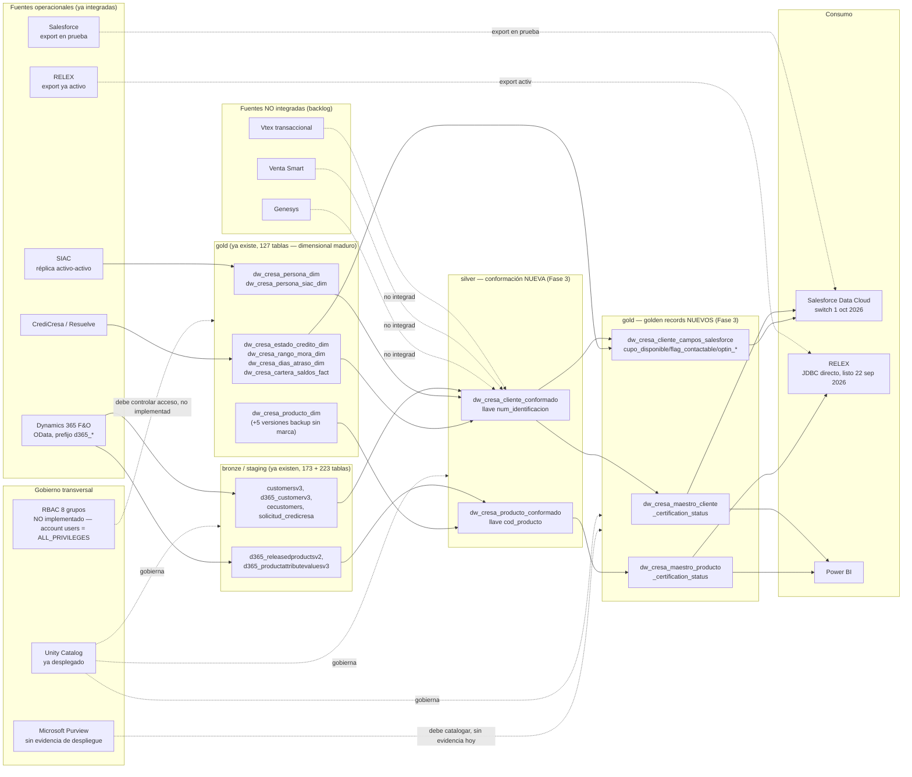
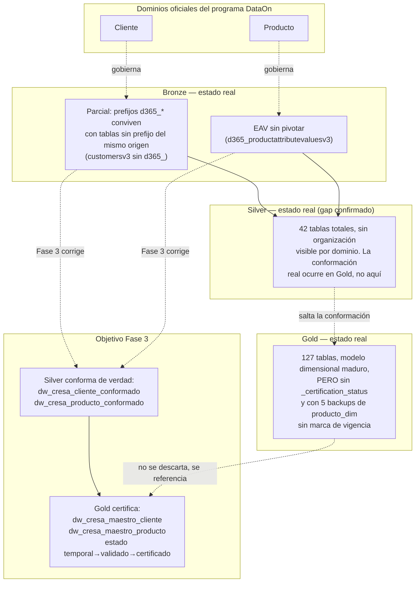

# Diagramas de Arquitectura y Dominios — Fase 3 (CRESA)

> Adaptado del anexo equivalente de Almar Fase 3. Diferencia clave: aquí el catálogo (`dlh_cresa`) y los esquemas por capa (`bronze`, `silver`, `gold`, `staging`, `src`, `externo_cresa`) **ya existen y están en producción** — los diagramas muestran cómo conformar Cliente/Producto dentro de esa estructura, no cómo crearla desde cero.

## Alineación con dominios AS-IS / TO-BE

Fase 3 no redefine los 5 dominios de datos de CRESA. Profundiza en los 2 dominios liderados por Azurian (Cliente, Producto); Financiero, Crédito y Operaciones quedan bajo BusinessIT/Handytech (alcance exacto pendiente de confirmar, ver `06_hipotesis_validacion.md` #4).

| Responsable | Dominios |
|---|---|
| Azurian (Fase 3, este documento) | Cliente, Producto |
| Handytech / BusinessIT | Financiero, Crédito, Operaciones |

## Arquitectura de datos y gobierno — Cliente y Producto

## Dominios de datos por capa — estado real vs. objetivo

## Mensaje para el cliente

El punto de control más importante de Fase 3 no es cargar datos nuevos — **ya existen 649 tablas**. Es introducir la capa de conformación real en Silver (hoy inexistente para Cliente/Producto) y el estado de certificación en Gold (hoy inexistente en cualquier tabla). Si `num_identificacion` y `cod_producto` quedan conformados con reglas de supervivencia explícitas y trazables, Salesforce y RELEX pueden consumir un maestro único en vez de que cada integrador resuelva el cruce por su cuenta.
