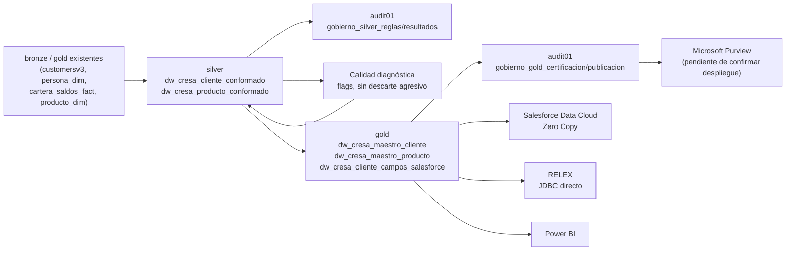

> **Revisión de consistencia — 2026-09-16.** Consultar el [estado vigente](../../pre_productiva/docs/ESTADO_VIGENTE.md) para los nombres Silver/Gold de Producción y Desarrollo, los 1,2 TB disponibles declarados y la evidencia posterior de fuentes. El diagnóstico y las métricas originales conservan su fecha de corte; las propuestas anteriores se aplican solo donde no contradigan los documentos 17/20. Este material no acredita implementación de los maestros.

# Plan de Ingesta y Almacenamiento Lakehouse — Fase 3 (CRESA)

## Decisión de arquitectura — diferencia clave frente a Almar

Almar diseñó catálogos nuevos por capa (`almar_bronze`, `almar_silver`, `almar_gold`, `almar_governance`) porque partía de cero. **CRESA ya tiene un catálogo único `dlh_cresa` con 9 esquemas en producción** (`bronze`, `silver`, `gold`, `staging`, `src`, `externo_cresa`, `fivetran_log`, `audit01`, `ai_cresa`). El principio rector de la Arquitectura To-Be es **mínima disrupción organizacional** — no se renombra ni reestructura el catálogo existente. La organización por dominio ocurre a nivel de **convención de nombres de tabla**, no de esquema/catálogo nuevo.

## Principios

| Principio | Aplicación en CRESA |
|---|---|
| No tocar lo que ya funciona | Bronze/staging/src siguen exactamente como están — 173+223+60 tablas no se reorganizan |
| Dominio en el nombre, no en el esquema | Silver y Gold usan el esquema ya existente (`silver`, `gold`) + prefijo de dominio en el nombre de tabla |
| Conformación real en Silver | Las entidades nuevas (`dw_cresa_cliente_conformado`, `dw_cresa_producto_conformado`) sí deben vivir en `silver`, corrigiendo el patrón actual donde la conformación salta directo a Gold |
| Certificación explícita en Gold | Todo producto Gold nuevo declara `_certification_status`; no aplica retroactivamente a las 127 tablas ya existentes salvo decisión explícita del Data Owner |
| Control plane sin esquema nuevo si es posible | Extender `audit01` (ya existe, 4 tablas: `dynamics_odata_run_summary`, `dynamics_odata_runlogs`, `job_run_logs`, `log_procesos`) antes de crear un esquema de gobierno nuevo |
| Formatos por alcance | Las tablas Delta productivas existentes se conservan. Para la implementación del paquete se mantienen snapshots Parquet y control plane Delta, según el documento 17 |

## Estructura lógica del diseño original (consultar actualización 17 para objetos auxiliares)

| Capa | Catálogo | Esquema | Convención de tabla |
|---|---|---|---|
| Bronze | `dlh_cresa` | `bronze` (ya existe) | Mantener convención de fuente ya usada (`d365_*`, `customersv3`) — **resolver primero la inconsistencia de prefijo** (ver `11_convenciones_nombramiento_databricks.md`) |
| Silver — conformación nueva | `dlh_cresa` | `silver` (ya existe) | `dw_cresa_<dominio>_conformado` — ej. `dw_cresa_cliente_conformado` |
| Gold — golden records nuevos | `dlh_cresa` | `gold` (ya existe) | `dw_cresa_maestro_<dominio>` — ej. `dw_cresa_maestro_cliente`, `dw_cresa_maestro_producto` |
| Gold — productos derivados | `dlh_cresa` | `gold` (ya existe) | `dw_cresa_<dominio>_<producto>` — ej. `dw_cresa_cliente_campos_salesforce` |
| Control/gobierno técnico | `dlh_cresa` | `audit01` (extender) | `gobierno_<entidad>` — ej. `gobierno_certificacion_gold`, `gobierno_reglas_silver` |

## Ejemplos del diseño original

```text
dlh_cresa.silver.dw_cresa_cliente_conformado
dlh_cresa.silver.dw_cresa_producto_conformado
dlh_cresa.gold.dw_cresa_maestro_cliente
dlh_cresa.gold.dw_cresa_maestro_producto
dlh_cresa.gold.dw_cresa_cliente_campos_salesforce
dlh_cresa.audit01.gobierno_certificacion_gold
dlh_cresa.audit01.gobierno_reglas_silver
```

## Metadata mínima obligatoria (nueva, para las tablas de Fase 3 — no retroactiva)

### Silver

| Campo | Propósito |
|---|---|
| `_domain_official` | `Cliente` o `Producto` |
| `_business_key` | `num_identificacion` / `cod_producto` |
| `_quality_status` | `ok` / `warning` / `failed` / `requires_review` |
| `_quality_flags` | Lista de reglas incumplidas |
| `_bronze_refs` | Referencia a tablas Bronze/Gold origen usadas en el cruce |
| `_valid_from`, `_valid_to` | Vigencia, si aplica (particularmente relevante para resolver el 2,28× de filas/SKU en Producto) |

### Gold

| Campo | Propósito |
|---|---|
| `_data_product_name` | Nombre del producto de datos |
| `_certification_status` | `temporal` / `validado` / `certificado` / `restringido` / `deprecated` |
| `_data_owner` | Persona/rol responsable (pendiente de designación formal) |
| `_last_certified_at` | Fecha de última certificación |
| `_sensitivity_classification` | `Público` / `Interno` / `Confidencial` / `Sensible-Regulado` (cap. 4.4 Arquitectura To-Be) |

## Antecedente del control plane — nombres de gobierno anteriores

`audit01` ya existe con 4 tablas de auditoría de ingesta Dynamics/jobs. Se propone extenderlo, no crear un esquema paralelo:

| Tabla nueva propuesta | Propósito |
|---|---|
| `audit01.gobierno_silver_reglas` | Reglas de cleansing/conformación aplicadas por entidad Silver |
| `audit01.gobierno_silver_resultados` | Resultados agregados por regla, lote y entidad |
| `audit01.gobierno_gold_certificacion` | Historial de cambios de `_certification_status` por producto Gold |
| `audit01.gobierno_gold_publicacion` | Publicaciones hacia Salesforce/RELEX/Power BI por producto |

## Flujo de conformación propuesto



## Reglas de decisión

1. Ninguna tabla Bronze/staging/src existente se renombra ni se mueve de esquema en Fase 3.
2. Toda entidad Silver nueva declara `_bronze_refs` — no se pierde trazabilidad hacia lo que ya existe.
3. Ningún producto Gold nuevo lee directo de Bronze salvo excepción aprobada por el Data Owner del dominio.
4. Los datos Confidencial/Sensible (`cupo_disponible`, `dias_atraso`, identificación) se materializan en Silver/Gold vía pipeline propio con enmascaramiento — no se exponen más allá de Bronze vía catálogo foráneo (principio ya fijado en Arquitectura To-Be 4.4bis, porque Lakehouse Federation no soporta Column Masks/Row Filters).
5. Todo producto Gold nuevo declara consumidores esperados (Salesforce, RELEX, Power BI) desde su creación, no después.
