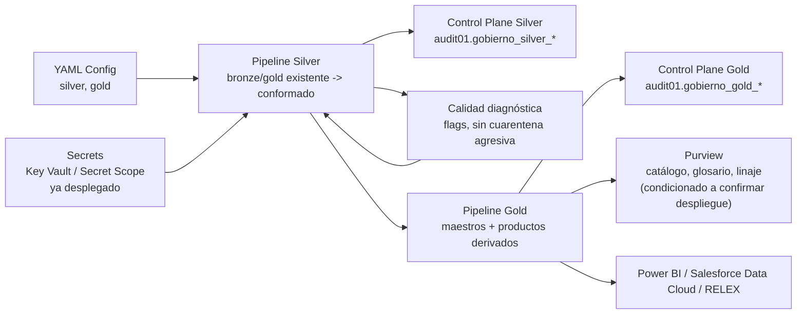

> **Revisión de consistencia — 2026-09-16.** Consultar el [estado vigente](../../pre_productiva/docs/ESTADO_VIGENTE.md) para los nombres Silver/Gold de Producción y Desarrollo, los 1,2 TB disponibles declarados y la evidencia posterior de fuentes. El diagnóstico y las métricas originales conservan su fecha de corte; las propuestas anteriores se aplican solo donde no contradigan los documentos 17/20. Este material no acredita implementación de los maestros.

# Metodología Lakehouse y Gobierno — Fase 3 (CRESA)

## Propósito

Define cómo se implementa Fase 3 del programa DataOn (dominios Cliente y Producto) sobre la plataforma Databricks/Unity Catalog **ya desplegada** (`adbdlh01`, catálogo `dlh_cresa`), adoptando el patrón de gobierno metadata-driven ya validado por Azurian en otro proyecto (Grupo Almar) pero respetando el principio de mínima disrupción de la Arquitectura To-Be de CRESA: no se crean catálogos nuevos, no se renombra lo existente, no se introduce Microsoft Fabric.

La metodología aplica a las fuentes ya integradas:

- Dynamics 365 F&O (OData)
- SIAC (cartera)
- CrediCresa / Resuelve
- RELEX (bidireccional, export ya activo)
- Salesforce (export en prueba)

Y habilita los casos priorizados: CU-01 (maestro único de clientes), CU-02 (calidad de contacto), CU-03 a CU-06 (Salesforce/BML), CU-07 (catálogo de productos, RELEX), CU-11 (segmentación RFM), CU-13 (Visión 360).

## Principios de arquitectura

| Principio | Decisión en CRESA |
|---|---|
| Trazabilidad primero | Bronze se mantiene exactamente como está — organizado por fuente (`d365_*`, `customersv3`, SIAC, CrediCresa) |
| Gobierno por dominio | Silver introduce, por primera vez, entidades organizadas por dominio oficial (Cliente/Producto) — hoy Silver no cumple ese rol |
| Consumo por producto | Gold nuevo se organiza por golden record y producto de datos, con estado de certificación explícito |
| Metadata-driven | Nuevas ingestas/transformaciones de Fase 3 se parametrizan con YAML — no se retrofittea a las 649 tablas existentes |
| Control plane por capa | Se extiende `audit01` (ya existe) en vez de crear un esquema de gobierno paralelo |
| Codigo reutilizable, configuración externa | Los notebooks contienen lógica genérica; los YAML contienen la particularidad de cada entidad/producto |
| No pérdida de datos en Silver | Silver marca problemas de calidad (duplicados, campos vacíos) sin descartar registros agresivamente |
| Certificación en Gold | Gold aplica reglas de calidad específicas por producto antes de publicar a Salesforce/RELEX |
| Catalogación desde el inicio (condicionada) | Purview cataloga activos temporales y certificados — **condicionado a confirmar que Purview esté desplegado** (ver `06_hipotesis_validacion.md` #1); si no lo está, el estado de certificación vive temporalmente en `audit01` hasta que se resuelva |
| Cero contrataciones nuevas | Roles de gobierno cubiertos con personal existente, dedicación parcial (principio ya fijado en Arquitectura To-Be) |

## Dominios oficiales y su relación con Fase 3

| Dominio | Rol en Fase 3 |
|---|---|
| Cliente | Golden record fundacional — identidad, contacto, segmento, atributos de crédito incorporados como referencia |
| Producto | Golden record fundacional — SKU único, jerarquía comercial, dimensiones físicas normalizadas |

Crédito, Financiero y Operaciones no son dominios de Azurian en esta fase (ver `08_alineacion_dominios_as_is_fase3.md`).

## Flujo metodológico end-to-end



## 1. Configuración metadata-driven

Tres familias de YAML, igual que en el patrón Almar, pero apuntando al catálogo/esquemas ya existentes de CRESA:

| Familia YAML | Capa | Propósito |
|---|---|---|
| `silver_entity.yml` | Silver | Fuentes Bronze/Gold existentes, entidad conformada, llaves, reglas de cleansing, homologación |
| `gold_product.yml` | Gold | Producto de datos, fuentes Silver, reglas de certificación, contrato de salida, SLA, owner, sensibilidad, consumidores |
| `environment.yml` | Todas | Parámetros por ambiente — **relevante porque hoy CRESA no tiene separación DEV/TEST/PROD**; el YAML de ambiente debe declarar `prod` como único ambiente real hasta que se cierre ese gap estructural |

Nota: no se incluye una familia `ingestion.yml`/`source.yml` nueva para Bronze porque Fase 3 no introduce fuentes nuevas — las 173 tablas Bronze ya tienen su propio mecanismo de ingesta (OData Dynamics, Fivetran, batch). Las plantillas de fuente/ingesta se conservan en `templates_ingenieria/` por si Fase 3 necesita incorporar Vtex/Venta Smart/Genesys más adelante.

Estructura de repositorio sugerida:

```text
config/
  silver/
    cliente.dw_cresa_cliente_conformado.yml
    producto.dw_cresa_producto_conformado.yml
  gold/
    cliente.dw_cresa_maestro_cliente.yml
    cliente.dw_cresa_cliente_campos_salesforce.yml
    producto.dw_cresa_maestro_producto.yml
  environments/
    prod.yml
```

### YAML de entidad Silver (ejemplo real — Cliente)

```yaml
entity_name: dw_cresa_cliente_conformado
domain_official: Cliente
enabled: true

sources:
  - table: dlh_cresa.bronze.customersv3
    alias: dyn
    required: true
  - table: dlh_cresa.gold.dw_cresa_persona_dim
    alias: siac
    required: true
  - table: dlh_cresa.silver.base_concrecion_cliente
    alias: canal
    required: false   # hoy tiene 0 filas — no bloquea la conformación

business_key:
  - num_identificacion

survivorship:
  # Regla ya definida en Arquitectura To-Be 4.1bis
  contacto: [dyn, siac]     # más reciente por timestamp
  credito: [credicresa]     # siempre CrediCresa, nunca Dynamics
  direccion: solo_si_validada

quality_diagnostic:
  action: flag_only
  rules:
    - rule_id: SV_CLI_001
      type: not_null
      columns: [num_identificacion]
    - rule_id: SV_CLI_002
      type: duplicate_natural_key
      columns: [num_identificacion]

target:
  catalog: dlh_cresa
  schema: silver
  table: dw_cresa_cliente_conformado
```

### YAML de producto Gold (ejemplo real — quick win Salesforce)

```yaml
product_name: dw_cresa_cliente_campos_salesforce
domain_owner: Cliente
status: temporal
enabled: true

sources:
  - table: dlh_cresa.silver.dw_cresa_cliente_conformado
    required: true
  - table: dlh_cresa.gold.dw_cresa_cartera_saldos_fact
    required: true

contract:
  grain: una_fila_por_num_identificacion
  primary_key: [num_identificacion]
  required_columns: [cupo_disponible, flag_contactable, optin_email, optin_whatsapp, optin_llamadas, num_cuota_actual, num_cuota_total]
  consumers: [salesforce_data_cloud]
  sla:
    refresh_frequency: daily
    hard_deadline: "2026-10-01"   # switch Salesforce Data Cloud

certification_rules:
  action_default: flag_only   # no rechazar por ahora — es un quick win, no un producto certificado
  rules:
    - rule_id: GD_SF_001
      type: not_null
      columns: [num_identificacion]

target:
  catalog: dlh_cresa
  schema: gold
  table: dw_cresa_cliente_campos_salesforce
```

## 2. Silver

Silver debe, por primera vez en CRESA, cumplir su función de conformación:

- Estandarizar nombres y resolver la llave natural (`num_identificacion`, `cod_producto`).
- Aplicar reglas de supervivencia explícitas (no implícitas como ocurre hoy en Gold).
- Mantener trazabilidad hacia Bronze/Gold origen (`_bronze_refs`).
- Marcar problemas de calidad sin descartar registros.

Silver no debe:
- Perder datos por reglas específicas de un producto Gold puntual (p. ej. no descartar SKUs sin dimensión física — son 92,4%, descartarlos vacía el maestro).
- Romper trazabilidad con la fuente Bronze/Gold que ya existe.
- Anticipar cálculos de certificación que corresponden a Gold.

## 3. Gold

Gold publica maestros y productos derivados, con estado de certificación explícito — inexistente hoy en las 127 tablas Gold de CRESA. Estados:

| Estado | Significado |
|---|---|
| `temporal` | Validación funcional o técnica — aplica inicialmente a los 3 productos de Fase 3 |
| `validado` | Revisado por Business Data Steward |
| `certificado` | Aprobado por el Data Owner del dominio (pendiente de designación) |
| `restringido` | Acceso limitado por sensibilidad — aplica a `cupo_disponible`, `dias_atraso` |
| `deprecated` | Reemplazado — aplicaría hoy mismo a 4 de las 5 versiones de backup de `dw_cresa_producto_dim` |

Productos Gold iniciales de Fase 3:

| Producto | Dominio | Caso de uso |
|---|---|---|
| `dw_cresa_maestro_cliente` | Cliente | CU-01, CU-13 |
| `dw_cresa_cliente_campos_salesforce` | Cliente | CU-03, CU-04, CU-05, CU-06 |
| `dw_cresa_maestro_producto` | Producto | CU-07, CU-11 |

## 4. Purview (condicionado)

Collections propuestas, **a crear solo si se confirma despliegue** (ver `06_hipotesis_validacion.md` #1):

```text
CRESA
  01_Cliente
  02_Producto
```

Si Purview no está desplegado, el estado de certificación y el glosario de negocio deben vivir temporalmente en `audit01.gobierno_gold_certificacion` y un documento de glosario en `Fase 3/`, migrando a Purview cuando esté disponible.

## 5. Calidad de datos

| Capa | Enfoque | Resultado en CRESA |
|---|---|---|
| Bronze | Calidad técnica | Ya cubierta parcialmente por `audit01` (4 tablas de log de Dynamics/jobs) |
| Silver | Calidad diagnóstica | Nueva en Fase 3 — hoy no existe ningún flag de calidad en las 42 tablas Silver actuales |
| Gold | Calidad de producto | Nueva en Fase 3 — hoy no existe ningún filtro de certificación en las 127 tablas Gold actuales |

## 6. Seguridad

Ya desplegado en CRESA: Managed Identity + Key Vault (`keyvaultdlh01`). Pendiente crítico, no resuelto por esta metodología: el grupo `account users` tiene `ALL_PRIVILEGES` sobre todo el catálogo `dlh_cresa` — el RBAC de 8 grupos técnicos sigue siendo trabajo estructural fuera del alcance de este documento (ver `Implementación/ARQUITECTURA_DESPLEGADA_VS_TOBE.md`).

## 7. Plantillas base para ingeniería

```text
Fase 3/templates_ingenieria/
  config/
    sources/source_template.yml
    ingestion/ingestion_table_template.yml
    silver/silver_entity_template.yml
    gold/gold_product_template.yml
    environments/environment_template.yml
  notebooks/template_pipeline_metadata_driven.ipynb
  docs/template_documentacion_pipeline.md
```

Las plantillas de `sources/` e `ingestion/` se conservan aunque Fase 3 no las use de inmediato — quedan listas para cuando se incorpore Vtex, Venta Smart o Genesys (backlog, ver `02_bronze_relevante.md` §3).

## 8. Ruta de implementación

1. Confirmar estado real de Microsoft Purview (bloqueador de decisión, no de ejecución).
2. Crear las tablas de control en `audit01` (`gobierno_silver_reglas`, `gobierno_silver_resultados`, `gobierno_gold_certificacion`, `gobierno_gold_publicacion`).
3. Implementar `dw_cresa_cliente_conformado` en Silver (Cliente).
4. Implementar `dw_cresa_producto_conformado` en Silver (Producto).
5. Implementar `dw_cresa_cliente_campos_salesforce` en Gold — quick win, fecha dura 25 ago–12 sept 2026.
6. Implementar `dw_cresa_maestro_cliente` y `dw_cresa_maestro_producto` en Gold, estado `temporal`.
7. Validar con Data Owners una vez designados (bloqueador escalado, ver `06_hipotesis_validacion.md` #2).
8. Catalogar en Purview con estado `temporal` (si aplica) o en `audit01` (si no).
9. Promover productos de `temporal` a `validado`/`certificado` antes del switch de Salesforce (1 oct 2026) y de la entrega a RELEX (22 sept 2026).
